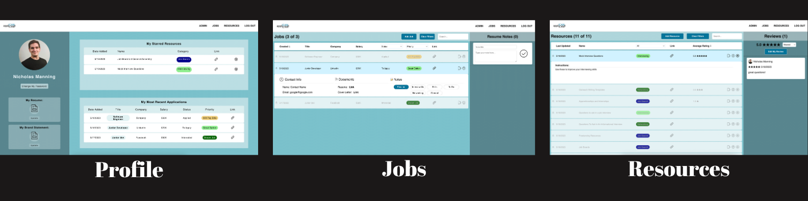

# appliCANt

Post graduation from a Software Engineering bootcamp, the search for a job can be daunting for individuals. **appliCANt** is here to put the "CAN" in "I CAN find a job". 

**appliCANt** is a comprehensive job search tracker designed to simplify and streamline the job application process. With AppliCANt, users can effortlessly manage and organize their job applications, keeping track of crucial information such as application status, interview dates, job contact details, etc.

The platform allows users to attach notes and documents to each application, enabling them to maintain a centralized repository of information related to specific jobs. 

**appliCANt** provides users with access to a wide range of curated resources and tools to enhance their job search, including resume templates, interview tips, and industry-specific advice. By combining powerful features and user-friendly functionality, **appliCANt** empowers job seekers to navigate their job search journey more efficiently and effectively.

## Click **[HERE](https://job-applicant.netlify.app/)** to use the app

## **Current Features:**
Both the Profile and Job pages are unique to each user protecting potentially sensitive information. The Resources page is available to all users.
### Profile Page: 
* Users can link to their resume
* Users can link to their brand statement
* Users can change their password
* Users can quickly access their starred resources
* Users can remove starred resources
* Users are presented with the last 3 jobs they updated within the app 
* Users can click on a recent job and be taken to that job within the job page 

### Jobs Page:
* Users can add a new job
* Users can edit a job
* Users can delete a job
* Users can search for a job by title and company
* Users can sort jobs by job creation date, job title, company, or salary
* Users can filter jobs by status, priority, or salary
* Users can set and edit details of a job including contact information and  catered resumes and cover letters
* Users add and delete notes about the job within 6 categories: resume, interview questions, skills, to-do, networking, and general

### Resources Page:
* Admins can add a new resource
* Admins can edit a resource
* Admins can delete a resource
* Users can sort resources via the resource's last update, name, or average rating
* Users can filter resources by category
* Users can search for a resource by name
* Users can add or remove a resource to their starred resources
* Users can see other users' ratings of a resource
* Users can rate a resource

## **Technologies Used:**

**appliCANt** is a full-stack application that uses a React front-end and a Node/Express back-end connecting with a Mongo DB database via Mongoose. The back end is deployed on Fly.io and the front end is deployed on Netlify.

* React
* MUI
* JWT
* Git
* GitHub
* JavaScript
* CSS
* HTML
* Netlify

In addition to the technologies listed above, **appliCANt** uses the following for its back-end application:
* MongoDB
* Mongoose
* bcrypt
* Node
* Express
* Fly.io

## **Planning Materials:**
User stories that inspired the creation of this app, wireframes, and ERD can be found [Here](https://trello.com/b/dF61KUj4/applicant)

## **Attributions:**
* UI icons in AppliCANt from [flaticon](https://www.flaticon.com/uicons/interface-icons)
* AppliCANt uses the font *Canada Type Gibson* from [Adobe Fonts](https://fonts.adobe.com/fonts/gibson)

## **AppliCANt** was created by:
* [Callum Nelson](https://github.com/callumnelson)
* [Suzanne Trammel](https://github.com/strammel33)
* [Nicholas Manning](https://github.com/njmanning212)

## Backend Repo:
The backend repo for **appliCANt** can be found [here](https://github.com/callumnelson/applicant-back-end)

## **Ice Box:**
* [x] Admin portal to manage users and resources
* [x] Redirect from landing page to specific profile page if a user is logged in
* [x] Multidminesional sorting and filtering on jobs and resources
* [ ] Add the ability for users to change their profile picture
* [ ] Add a Coach role
* [ ] Add a Coach dashboard
* [ ] Allow coaches to add resources
* [ ] Allow coaches to edit and delete resources they created
* [ ] Allow coaches to claim students
* [ ] Give coaches the ability to view all of their students' jobs and progress
* [ ] Create a chat feature to allow coaches to communicate with their students both individually and in groups
